# 🧠 AI Unboxed: From ChatGPT to Intelligent Machines

> **Codelab Duration:** ~3 hours (including hands-on demo)
> **Level:** Intermediate
> **Prerequisites:** Basic programming knowledge (Python preferred), familiarity with ML terminology helpful but not required
> **What You'll Build:** A custom image classifier using Google's Teachable Machine, exported as a TensorFlow/Keras model and integrated into Python code

---

## Table of Contents

| # | Module | Section |
|---|--------|---------|
| 1 | [How AI Actually Learns](#1-how-ai-actually-learns) | Foundation |
| 2 | [Why AI Feels Intelligent](#2-why-ai-feels-intelligent) | Foundation |
| 3 | [Hallucinations](#3-hallucinations) | Foundation |
| 4 | [Overfitting vs Underfitting](#4-overfitting-vs-underfitting) | Foundation |
| 5 | [AI Bias](#5-ai-bias) | Foundation |
| 6 | [Tokenization](#6-tokenization) | Core NLP |
| 7 | [Embeddings](#7-embeddings) | Core NLP |
| 8 | [Attention Mechanism](#8-attention-mechanism) | Core NLP |
| 9 | [Chunking — Fundamentals & Strategies](#9-chunking--fundamentals--strategies) | RAG Pipeline |
| 10 | [Chunk Size & Overlap](#10-chunk-size--overlap) | RAG Pipeline |
| 11 | [Vector Databases](#11-vector-databases) | RAG Pipeline |
| 12 | [Lexical vs Vector vs Hybrid Search](#12-lexical-vs-vector-vs-hybrid-search) | Search & Retrieval |
| 13 | [Reranking](#13-reranking) | Search & Retrieval |
| 14 | [Retrieval-Augmented Generation (RAG)](#14-retrieval-augmented-generation-rag) | Search & Retrieval |
| 15 | [Explainable AI (XAI)](#15-explainable-ai-xai) | Trust & Safety |
| 16 | [AI Evaluation Metrics](#16-ai-evaluation-metrics) | Trust & Safety |
| 17 | [Prompt Engineering](#17-prompt-engineering) | Applied AI |
| 18 | [AI Agents](#18-ai-agents) | Agentic AI |
| 19 | [Multi-Agent Systems](#19-multi-agent-systems) | Agentic AI |
| 20 | [Orchestration & MCP](#20-orchestration--mcp) | Agentic AI |
| 21 | [Knowledge Ingestion](#21-knowledge-ingestion) | Advanced RAG |
| 22 | [Retrieval Optimization](#22-retrieval-optimization) | Advanced RAG |
| 23 | [🔬 Hands-On: Teachable Machine Demo](#23--hands-on-teachable-machine-demo) | Practical |

---

## 1. How AI Actually Learns

### 🎯 Learning Objective
Understand the fundamental mechanism by which AI models learn from data — moving beyond the "black box" perception.

### 💡 Concept

AI learns through **iterative numerical optimization**, not "thinking." At its core, every AI model follows a loop:

```
Data → Prediction → Error Measurement → Weight Adjustment → Repeat
```

#### The Learning Loop (Gradient Descent)

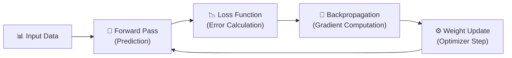

1. **Forward Pass:** Data flows through a network of interconnected "neurons" (simple math functions: `output = activation(weights × input + bias)`). Each neuron multiplies inputs by weights, sums them, and passes the result through an activation function.

2. **Loss Function:** The model's prediction is compared against the true answer. The difference is quantified as a single number — the **loss**. Common loss functions:
   - **MSE (Mean Squared Error):** For regression — `L = (1/n) Σ(yᵢ − ŷᵢ)²`
   - **Cross-Entropy:** For classification — `L = −Σ yᵢ log(ŷᵢ)`

3. **Backpropagation:** The loss is propagated *backwards* through the network using the **chain rule of calculus**. This tells each weight how much it contributed to the error and in which direction it should change.

4. **Optimizer:** Updates each weight using the gradient:
   - `w_new = w_old − learning_rate × gradient`
   - Advanced optimizers (Adam, AdaGrad) adapt the learning rate per-parameter.

5. **Epochs:** The entire dataset is passed through this loop many times. Each full pass = **1 epoch**.

#### Analogy
> Imagine adjusting millions of tiny dials on a massive mixing board. Each dial controls a tiny piece of the output. After each song you play, you listen to the result, identify what sounds wrong, and nudge each dial slightly. After thousands of songs, the board produces beautiful music — but it never "understood" music. It found a mathematical configuration that maps inputs to the right outputs.

### 🔑 Key Takeaway
> AI doesn't "understand" — it **optimizes a mathematical function** to minimize prediction error. Intelligence is an emergent property of scale, data, and optimization — not comprehension.

---

## 2. Why AI Feels Intelligent

### 🎯 Learning Objective
Demystify why modern AI systems appear to reason, create, and understand — even though they're pattern-matching engines.

### 💡 Concept

Modern LLMs (GPT-4, Gemini, Claude) feel intelligent because of **four converging factors:**

| Factor | What It Does | Scale |
|--------|-------------|-------|
| **Massive Data** | The model has "seen" most of human knowledge | Trillions of tokens |
| **Scale (Parameters)** | More parameters = more patterns captured | Billions of weights |
| **Attention Mechanism** | Enables contextual understanding | Every token attends to every other |
| **RLHF / Fine-Tuning** | Aligns outputs with human preferences | Thousands of human evaluators |

#### Emergence
At sufficient scale, models exhibit **emergent behaviors** — capabilities that weren't explicitly trained but appear spontaneously:
- Chain-of-thought reasoning
- Few-shot learning from examples in the prompt
- Code generation from natural language descriptions
- Multilingual translation without explicit training pairs

#### The Stochastic Parrot Debate
There is an active debate: Are LLMs truly reasoning, or are they sophisticated **"stochastic parrots"** — generating statistically likely next tokens based on patterns?

```
Input:  "The capital of France is ___"
Model:  P("Paris") = 0.97, P("Lyon") = 0.01, P("Berlin") = 0.002, ...
Output: "Paris"  ← Statistically most likely continuation
```

The model isn't "recalling" a fact — it's completing a pattern it's seen thousands of times in training data.

### 🔑 Key Takeaway
> AI feels intelligent because it learned patterns from virtually all digitized human knowledge. It's *functionally* useful even without genuine understanding — but knowing this distinction is critical for building safe, trustworthy AI systems.

---

## 3. Hallucinations

### 🎯 Learning Objective
Understand why AI confidently produces false information and how to mitigate this critical failure mode.

### 💡 Concept

**Hallucination** = The model generates content that is **fluent, confident, and wrong**. This is not a bug — it's a structural consequence of how language models work.

#### Why Hallucinations Happen

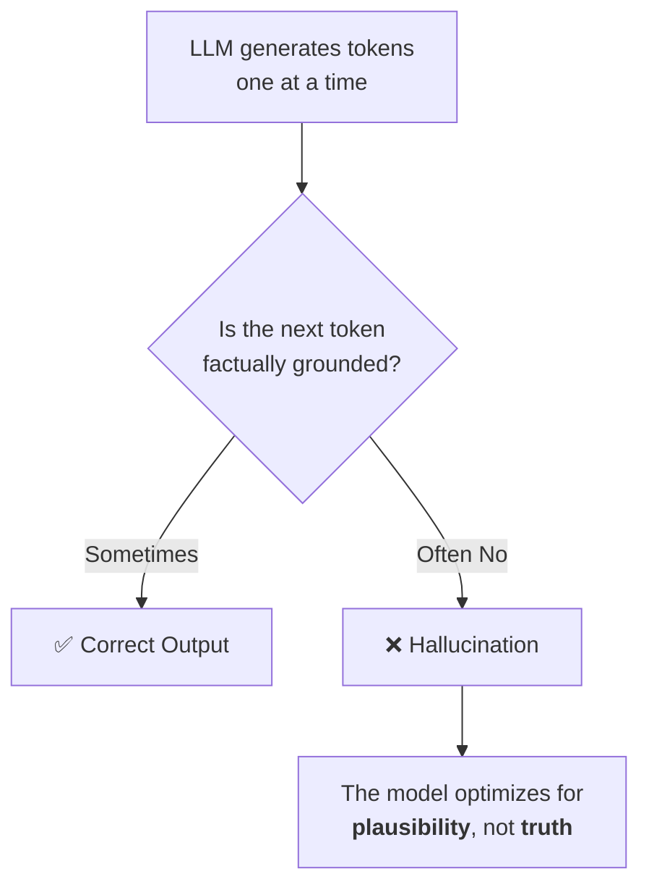

1. **No Internal Knowledge Base:** LLMs don't have a database of facts they look up. Everything is encoded in weight matrices — lossy compression of training data.
2. **Next-Token Prediction:** The model always predicts the most *likely* next token. When the training data is sparse or ambiguous for a topic, it fills gaps with plausible-sounding but fabricated content.
3. **Confidence Calibration:** Models aren't trained to say "I don't know." They're trained to produce fluent text, so they fabricate confidently.

#### Types of Hallucinations

| Type | Example |
|------|---------|
| **Factual** | "The Eiffel Tower was built in 1912" (actual: 1889) |
| **Fabricated Citations** | Citing a paper that doesn't exist with a real-sounding author |
| **Entity Confusion** | Mixing up attributes of two similar people/concepts |
| **Logical** | Correct premises but invalid conclusion |

#### Mitigation Strategies
- **RAG (Retrieval-Augmented Generation):** Ground the model in retrieved documents (covered in Section 14)
- **Temperature Control:** Lower temperature → more conservative, factual outputs
- **Chain-of-Thought Prompting:** Force step-by-step reasoning
- **Fact-Checking Layers:** Post-processing verification pipelines
- **Grounding APIs:** Connect LLMs to search engines or knowledge bases for real-time fact verification

### 🔑 Key Takeaway
> Hallucinations are an inherent property of generative models. **Never trust LLM output as ground truth** — always verify, especially for critical applications (medical, legal, financial).

---

## 4. Overfitting vs Underfitting

### 🎯 Learning Objective
Understand the two fundamental failure modes in model training and how to find the "sweet spot."

### 💡 Concept

```
Model Performance
       │
       │     Underfitting          Sweet Spot          Overfitting
       │    ┌──────────┐       ┌──────────────┐     ┌────────────┐
       │    │ Too simple│       │  Just right   │     │ Too complex │
       │    │ Can't learn│       │  Generalizes  │     │ Memorizes   │
       │    │ patterns  │       │  well         │     │ training    │
       │    └──────────┘       └──────────────┘     └────────────┘
       │
       └───────────────────────────────────────────────────────────→
                            Model Complexity
```

#### Underfitting (High Bias)
- **What:** Model is too simple to capture the underlying patterns in the data.
- **Symptoms:** Poor performance on *both* training and test data.
- **Cause:** Insufficient model capacity, too few features, excessive regularization.
- **Example:** Using a linear model to fit curved data.

#### Overfitting (High Variance)
- **What:** Model memorizes the training data (including noise) instead of learning general patterns.
- **Symptoms:** Excellent training performance, *poor* test/validation performance.
- **Cause:** Too complex a model, too little training data, training for too many epochs.
- **Example:** A model that perfectly classifies every training image but fails on new images.

#### The Bias-Variance Tradeoff

| | Underfitting | Good Fit | Overfitting |
|---|---|---|---|
| **Training Accuracy** | Low | High | Very High |
| **Test Accuracy** | Low | High | Low |
| **Bias** | High | Low | Low |
| **Variance** | Low | Low | High |

#### Techniques to Combat Overfitting
- **Regularization:** L1/L2 penalties on weights
- **Dropout:** Randomly disable neurons during training
- **Early Stopping:** Stop training when validation loss starts increasing
- **Data Augmentation:** Artificially expand training data (rotate, flip, crop images)
- **Cross-Validation:** Use k-fold validation to assess generalization

> [!IMPORTANT]
> In the Teachable Machine demo (Section 23), you'll see this firsthand. Training with too few samples per class risks overfitting — the model memorizes specific images rather than learning the concept of "laptop" vs "mobile."

### 🔑 Key Takeaway
> The goal is a model that **generalizes** — performs well on data it has never seen. Overfitting is the most common trap in practice. Always validate on a held-out test set.

---

## 5. AI Bias

### 🎯 Learning Objective
Recognize how bias enters AI systems at every stage of the pipeline and why it matters.

### 💡 Concept

AI bias isn't a single problem — it's a **systemic issue** that can enter at every stage:

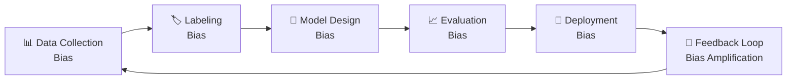

#### Sources of Bias

| Stage | Example |
|-------|---------|
| **Data Collection** | Training a facial recognition model primarily on light-skinned faces → poor accuracy for darker skin tones |
| **Historical Bias** | Training on hiring data that reflects historical gender discrimination → model perpetuates bias |
| **Representation Bias** | Underrepresenting certain demographics, geographies, or languages in training data |
| **Measurement Bias** | Using proxy features (e.g., zip code as a proxy for race) |
| **Aggregation Bias** | Treating a heterogeneous population as homogeneous |
| **Evaluation Bias** | Testing only on majority group → artificially inflated accuracy |
| **Deployment Bias** | Using a model outside its intended context or population |

#### Real-World Impact
- **Amazon's Hiring AI (2018):** Penalized resumes containing the word "women's" because historical hiring data was male-dominated.
- **COMPAS Recidivism (2016):** Predicted higher recidivism risk for Black defendants vs. White defendants with similar profiles.
- **Healthcare Algorithms:** An algorithm used on ~200 million patients systematically favored White patients over sicker Black patients for care programs.

#### Mitigation
- **Diverse, representative training data**
- **Bias audits** at every pipeline stage
- **Fairness metrics** (demographic parity, equalized odds, calibration)
- **Human-in-the-loop** review for high-stakes decisions
- **Model cards & datasheets** for transparency

### 🔑 Key Takeaway
> **AI reflects the biases in its training data and design choices.** Bias mitigation must be proactive, continuous, and built into the entire ML lifecycle — not an afterthought.

---

## 6. Tokenization

### 🎯 Learning Objective
Understand how raw text is converted into the numerical sequences that AI models actually process.

### 💡 Concept

LLMs don't process words — they process **tokens**. Tokenization is the first step in the NLP pipeline.

#### What is a Token?
A token is a sub-word unit that the model treats as a single element. Depending on the tokenizer:

```
"Unbreakable" → ["Un", "break", "able"]       # 3 tokens (BPE)
"ChatGPT"     → ["Chat", "G", "PT"]            # 3 tokens
"Hello!"      → ["Hello", "!"]                  # 2 tokens
"I'm"         → ["I", "'m"]                     # 2 tokens
```

#### Common Tokenization Methods

| Method | How It Works | Used By |
|--------|-------------|---------|
| **Byte-Pair Encoding (BPE)** | Iteratively merges the most frequent character pairs | GPT family |
| **WordPiece** | Similar to BPE, uses likelihood-based merging | BERT, Gemini |
| **SentencePiece** | Language-agnostic, works on raw text (no pre-tokenization) | T5, LLaMA |
| **Unigram** | Starts with a large vocabulary, prunes by information loss | XLNet |

#### BPE Algorithm (Simplified)

```
Step 1: Start with character-level vocabulary
        ["a", "b", "c", "d", ..., " "]

Step 2: Count all adjacent character pairs in corpus
        ("t", "h") → 1,234,567 times
        ("t", "e") →   456,789 times
        ...

Step 3: Merge the most frequent pair into a new token
        "t" + "h" → "th"

Step 4: Repeat Steps 2-3 until vocabulary reaches target size (e.g., 50,000 tokens)
```

#### Why Tokenization Matters

- **Context Window:** LLMs have a fixed token limit (e.g., 128K tokens). Inefficient tokenization = less content per prompt.
- **Cost:** API pricing is per-token. More tokens = higher cost.
- **Multilingual Parity:** English text is tokenized ~1.5× more efficiently than many other languages. The same sentence in Hindi may consume 3× more tokens than in English.
- **Edge Cases:** Code, URLs, numbers, and rare words can produce unexpectedly many tokens.

### 🔑 Key Takeaway
> Tokenization determines how the model "sees" your text. It's not word-level — it's sub-word-level. Understanding token budgets is essential for prompt engineering and RAG pipeline design.

---

## 7. Embeddings

### 🎯 Learning Objective
Understand how AI represents meaning as high-dimensional vectors — and why this enables semantic understanding.

### 💡 Concept

An **embedding** is a dense numerical vector that captures the *semantic meaning* of a token, word, sentence, or document in a continuous vector space.

```
"king"   → [0.21, -0.45, 0.89, ..., 0.12]   # 768 dimensions
"queen"  → [0.19, -0.43, 0.91, ..., 0.14]   # Very similar vector!
"banana" → [0.78,  0.02, -0.33, ..., 0.67]  # Very different vector
```

#### The Magic of Embedding Spaces

```
              Semantic Space (simplified to 2D)
                    │
        queen ●     │     ● king
                    │
                    │
        woman ●     │     ● man
                    │
    ────────────────┼────────────────
                    │
       banana ●     │     ● apple
                    │
                    │     ● car
                    │
```

#### Key Properties
- **Semantic Similarity:** Similar concepts have similar vectors. `cosine_similarity(king, queen) ≈ 0.95`
- **Arithmetic:** `vector("king") − vector("man") + vector("woman") ≈ vector("queen")`
- **Dimensionality:** Modern embeddings use 768–3072 dimensions to capture nuance.

#### Types of Embeddings

| Type | Scope | Use Case | Models |
|------|-------|----------|--------|
| **Word Embeddings** | Single word | Word similarity | Word2Vec, GloVe, FastText |
| **Sentence Embeddings** | Full sentence | Semantic search | SBERT, USE, Instructor |
| **Document Embeddings** | Paragraphs/pages | Document retrieval | Voyage, OpenAI `text-embedding-3`, Gemini |
| **Multimodal Embeddings** | Text + Images | Cross-modal search | CLIP, SigLIP |

#### How Embeddings Are Created
1. **Training:** A neural network is trained on massive text corpora with objectives like "predict the next word" or "identify if two sentences are related."
2. **Extraction:** The internal representations (hidden states) of this network become the embedding vectors.
3. **Usage:** These vectors are stored and compared using **distance metrics** (cosine similarity, Euclidean distance, dot product).

> [!TIP]
> In the RAG pipeline (Sections 11–14), embeddings are the foundation. Documents and queries are both converted to embeddings, and similarity search finds the most relevant documents to ground the LLM's response.

### 🔑 Key Takeaway
> Embeddings are how AI converts human language into a mathematical space where **meaning can be measured, compared, and computed.** They are the backbone of semantic search, RAG, and recommendation systems.

---

## 8. Attention Mechanism

### 🎯 Learning Objective
Understand the core innovation that powers modern LLMs — the Transformer's self-attention mechanism.

### 💡 Concept

The **Attention Mechanism** allows a model to dynamically focus on the most relevant parts of the input when processing each token. It answers the question: *"When generating this word, which other words should I pay attention to?"*

#### The Problem Before Attention
- **RNNs/LSTMs** processed sequences left-to-right, one token at a time.
- Long-range dependencies were lost (the model "forgot" the beginning by the end).
- Processing was sequential → slow, not parallelizable.

#### Self-Attention: The Key Insight

For each token in the input, attention computes three vectors:

| Vector | Role | Analogy |
|--------|------|---------|
| **Query (Q)** | "What am I looking for?" | A search query |
| **Key (K)** | "What do I contain?" | An index/tag for each token |
| **Value (V)** | "What information do I carry?" | The actual content to retrieve |

#### The Attention Formula

```
Attention(Q, K, V) = softmax(Q × Kᵀ / √dₖ) × V
```

- `Q × Kᵀ` → Compute similarity between every pair of tokens (attention scores)
- `/ √dₖ` → Scale to prevent large values (numerical stability)
- `softmax(...)` → Normalize into a probability distribution (weights sum to 1)
- `× V` → Weighted sum of values → the output for each position

#### Example: How Attention Works

```
Sentence: "The cat sat on the mat because it was tired"

When processing "it":
  - High attention to "cat"  (0.72) ← "it" refers to the cat
  - Low attention to "mat"   (0.08)
  - Low attention to "the"   (0.03)
  - Medium attention to "sat" (0.12)
```

#### Multi-Head Attention
Instead of one set of Q, K, V, Transformers use **multiple "heads"** (e.g., 96 heads in GPT-4) in parallel. Each head learns to attend to different types of relationships:
- Head 1 might focus on **syntactic** relationships (subject-verb agreement)
- Head 2 might focus on **semantic** relationships (coreference resolution)
- Head 3 might focus on **positional** patterns (nearby words)

The outputs of all heads are concatenated and linearly projected.

### 🔑 Key Takeaway
> Attention is the mechanism that lets Transformers **dynamically weigh the importance of every input token relative to every other token** — enabling true contextual understanding and the end of the "forgetting" problem in NLP.

---

## 9. Chunking — Fundamentals & Strategies

### 🎯 Learning Objective
Understand why and how documents are split into chunks for RAG pipelines, and the tradeoffs of different strategies.

### 💡 Concept

**Chunking** is the process of splitting documents into smaller segments (chunks) before embedding and indexing. It's a critical step because:

1. **Embedding models have input limits** (typically 512–8192 tokens)
2. **Smaller, focused chunks** improve retrieval precision
3. **Context windows are finite** — you can only feed so many chunks to the LLM

#### Chunking Strategies

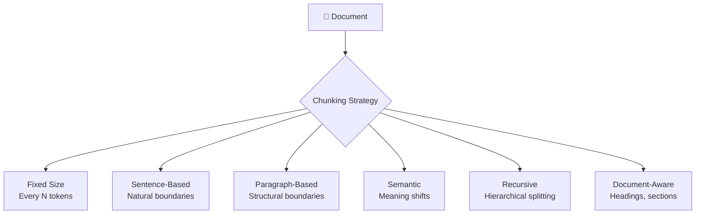

| Strategy | How It Works | Best For | Drawback |
|----------|-------------|----------|----------|
| **Fixed-Size** | Split every N characters/tokens | Simple, predictable | Cuts mid-sentence |
| **Sentence Splitting** | Split on sentence boundaries | Conversational text | Sentences vary wildly in length |
| **Paragraph Splitting** | Split on `\n\n` boundaries | Well-structured docs | Paragraphs can be very long |
| **Semantic Chunking** | Detect topic shifts using embedding similarity | Research papers, long-form content | Computationally expensive |
| **Recursive Character Splitting** | Try paragraph → sentence → word boundaries in order | General purpose (LangChain default) | May still split awkwardly |
| **Document-Aware** | Use headings (H1, H2), sections, markdown structure | Technical docs, wikis | Requires structured input |
| **Agentic Chunking** | An LLM decides chunk boundaries | Highest quality | Slow and expensive |

> [!TIP]
> **There is no universally best chunking strategy.** The right choice depends on your document type, embedding model, and retrieval requirements. Always benchmark multiple strategies on your specific data.

### 🔑 Key Takeaway
> Chunking directly impacts retrieval quality. Poorly chunked documents lead to irrelevant retrievals, which cause hallucinated or low-quality LLM outputs. Invest time in tuning your chunking strategy.

---

## 10. Chunk Size & Overlap

### 🎯 Learning Objective
Learn how to tune the two most important hyperparameters in any chunking strategy.

### 💡 Concept

#### Chunk Size

```
                    ←── Chunk Size ──→

    Small Chunks (100-200 tokens)        Large Chunks (1000-2000 tokens)
    ┌─────────────────────────┐          ┌─────────────────────────────────────┐
    │ High precision           │          │ More context per chunk               │
    │ Specific answers         │          │ Better for complex questions         │
    │ More chunks to search    │          │ Fewer chunks, faster search          │
    │ May lose context         │          │ May include irrelevant info          │
    └─────────────────────────┘          └─────────────────────────────────────┘
```

| Chunk Size | Pros | Cons |
|-----------|------|------|
| **Small (100–250 tokens)** | Precise retrieval, less noise | Loss of context, more index overhead |
| **Medium (250–512 tokens)** | Good balance (recommended start) | May split some complex ideas |
| **Large (512–2000 tokens)** | Rich context, fewer chunks | Less precise, may overwhelm LLM |

#### Overlap

Overlap ensures that information at chunk boundaries isn't lost.

```
Document: [A A A A A|B B B B B|C C C C C]

No Overlap:        [A A A A A] [B B B B B] [C C C C C]
                    ↑ Information at boundary A|B is split

With 20% Overlap:  [A A A A A B] [A B B B B B C] [B C C C C C]
                     ↑ Boundary context preserved in both chunks
```

#### Recommended Starting Points

| Use Case | Chunk Size | Overlap |
|----------|-----------|---------|
| **Q&A over docs** | 256–512 tokens | 10–20% |
| **Summarization** | 1000–2000 tokens | 5–10% |
| **Code search** | Function/class-level | 0% (use AST-aware splitting) |
| **Chat with PDF** | 512 tokens | 50–100 tokens |

> [!NOTE]
> These are starting points. Always iterate: chunk → embed → retrieve → evaluate → adjust. Use metrics like **retrieval recall@k** and **answer faithfulness** to guide tuning.

### 🔑 Key Takeaway
> Chunk size controls the **precision vs. context tradeoff**. Overlap prevents **boundary information loss**. Start with ~512 tokens / 10-20% overlap and iterate based on your evaluation metrics.

---

## 11. Vector Databases

### 🎯 Learning Objective
Understand what vector databases are, how they work, and when to use them.

### 💡 Concept

A **Vector Database** is a specialized database optimized for storing, indexing, and querying high-dimensional vectors (embeddings).

#### How It Works

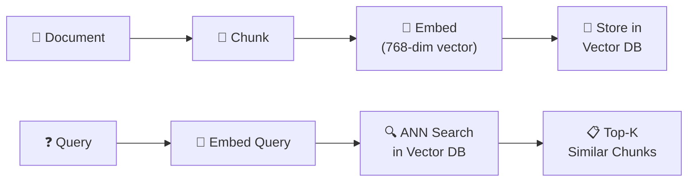

#### Why Not a Regular Database?
Traditional databases use exact-match queries (`SELECT * WHERE name = 'X'`). Vector search requires **approximate nearest neighbor (ANN)** search across millions of high-dimensional vectors — a fundamentally different computational problem.

#### ANN Indexing Algorithms

| Algorithm | How It Works | Tradeoff |
|-----------|-------------|----------|
| **HNSW** (Hierarchical Navigable Small World) | Multi-layer graph for navigable proximity search | Best recall, higher memory |
| **IVF** (Inverted File Index) | Clusters vectors, searches only relevant clusters | Fast, lower recall |
| **PQ** (Product Quantization) | Compresses vectors into smaller codes | Memory-efficient, lower precision |
| **ScaNN** | Google's hybrid approach with learned quantization | Balanced performance |

#### Popular Vector Databases

| Database | Type | Best For |
|----------|------|----------|
| **Pinecone** | Managed cloud | Production, zero-ops |
| **Weaviate** | Open-source | Hybrid search, multi-modal |
| **ChromaDB** | Open-source | Prototyping, local dev |
| **Qdrant** | Open-source | High-performance, filtering |
| **Milvus** | Open-source | Large-scale enterprise |
| **pgvector** | PostgreSQL extension | Adding vectors to existing Postgres |
| **FAISS** | Library (Meta) | Research, in-memory |

#### Metadata and Filtering
Modern vector DBs support **metadata filtering** — combining vector similarity with traditional filters:

```python
# Pseudocode: "Find chunks similar to my query, but only from 2024 documents"
results = vector_db.query(
    vector=embed("What is attention?"),
    filter={"year": 2024, "source": "arxiv"},
    top_k=5
)
```

### 🔑 Key Takeaway
> Vector databases are the **memory layer** of RAG systems. They make it possible to find semantically similar content across millions of documents in milliseconds, enabling grounded AI responses.

---

## 12. Lexical vs Vector vs Hybrid Search

### 🎯 Learning Objective
Compare the three major search paradigms and understand when to use each.

### 💡 Concept

#### Comparison

| Feature | Lexical Search | Vector Search | Hybrid Search |
|---------|---------------|---------------|---------------|
| **Mechanism** | Keyword matching (BM25/TF-IDF) | Semantic similarity (embeddings) | Both combined |
| **Understands Meaning?** | ❌ No | ✅ Yes | ✅ Yes |
| **Exact Matches** | ✅ Excellent | ❌ May miss | ✅ Excellent |
| **Synonyms/Paraphrasing** | ❌ Misses | ✅ Captures | ✅ Captures |
| **Speed** | Very fast | Fast (with ANN) | Moderate |
| **Best For** | Known terms, codes, IDs | Conceptual questions | Production systems |

#### How Each Works

**Lexical (BM25):**
```
Query: "machine learning optimization"
→ Scores documents by term frequency × inverse document frequency
→ Matches: "machine", "learning", "optimization" (exact words)
→ Misses: "neural network training" (same concept, different words)
```

**Vector Search:**
```
Query: "machine learning optimization" → embed → [0.34, -0.21, ...]
→ Finds nearest vectors in embedding space
→ Matches: "neural network training", "gradient descent methods"
→ Might miss: "ML_OPT_v2" (exact code/acronym)
```

**Hybrid Search:**
```
Query: "machine learning optimization"
→ BM25 scores + Vector similarity scores
→ Reciprocal Rank Fusion (RRF) or weighted combination
→ Best of both worlds
```

#### Reciprocal Rank Fusion (RRF)

```python
# Combine rankings from multiple retrieval methods
def rrf_score(doc, rankings, k=60):
    score = 0
    for ranking in rankings:
        rank = ranking.index(doc) + 1  # 1-indexed rank
        score += 1 / (k + rank)
    return score
```

### 🔑 Key Takeaway
> **Hybrid search is the gold standard for production RAG systems.** It combines the precision of keyword matching with the semantic understanding of embeddings, covering each method's blind spots.

---

## 13. Reranking

### 🎯 Learning Objective
Understand how reranking improves retrieval quality as a second-stage refinement.

### 💡 Concept

**Reranking** is a two-stage retrieval strategy:
1. **Stage 1 (Retrieval):** Fast, broad retrieval — get top 50–100 candidates using hybrid search.
2. **Stage 2 (Reranking):** Slow, precise scoring — a powerful model re-scores each candidate given the query.

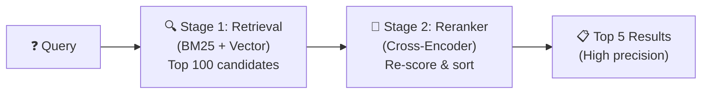

#### Why Reranking Works

| Method | Input | Speed | Quality |
|--------|-------|-------|---------|
| **Bi-Encoder** (embedding search) | Query and doc separately | ⚡ Very fast | Good |
| **Cross-Encoder** (reranker) | Query + doc concatenated | 🐢 Slow | Excellent |

- **Bi-Encoders** embed query and documents independently → can't model fine-grained interactions.
- **Cross-Encoders** process `[query + document]` together → capture word-level interactions but can't be pre-computed.

#### Popular Rerankers

| Reranker | Type |
|----------|------|
| **Cohere Rerank** | API-based, multilingual |
| **Jina Reranker** | Open-source, fast |
| **BGE Reranker** | Open-source (BAAI) |
| **FlashRank** | Lightweight, local |
| **Gemini/GPT as Reranker** | LLM-based, expensive but flexible |

### 🔑 Key Takeaway
> Reranking is the **highest-leverage improvement** you can make to a RAG pipeline. Retrieve broadly (top-100), then rerank to find the truly relevant top-5 documents.

---

## 14. Retrieval-Augmented Generation (RAG)

### 🎯 Learning Objective
Understand the full RAG architecture — the dominant paradigm for building grounded, factual AI applications.

### 💡 Concept

**RAG = Retrieval + Generation.** Instead of relying solely on the LLM's parametric memory (weights), RAG provides relevant external documents as context.

#### The RAG Pipeline

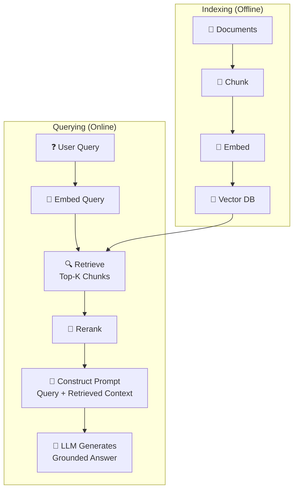

#### Why RAG?

| Problem | How RAG Solves It |
|---------|-------------------|
| **Hallucinations** | Grounds responses in real documents |
| **Stale Knowledge** | Access up-to-date information without retraining |
| **Domain Specificity** | Works with private/proprietary data |
| **Traceability** | Can cite sources for every claim |
| **Cost** | Cheaper than fine-tuning for most use cases |

#### RAG Prompt Template (Typical)

```
You are a helpful assistant. Answer the question based ONLY on the 
provided context. If the context doesn't contain the answer, say 
"I don't have enough information."

Context:
---
{retrieved_chunk_1}
---
{retrieved_chunk_2}
---
{retrieved_chunk_3}

Question: {user_query}

Answer:
```

#### RAG vs Fine-Tuning

| | RAG | Fine-Tuning |
|---|---|---|
| **Data freshness** | Real-time | Static (at training time) |
| **Cost** | Low (embedding + retrieval) | High (GPU training) |
| **Best for** | Factual Q&A, search | Style, format, persona |
| **Traceability** | ✅ Source citations | ❌ Opaque |
| **Data requirements** | Any amount | Thousands of examples |

### 🔑 Key Takeaway
> RAG is the **standard architecture for production AI applications** that need accurate, grounded, up-to-date responses. It's cheaper and more controllable than fine-tuning, with built-in source attribution.

---

## 15. Explainable AI (XAI)

### 🎯 Learning Objective
Understand why AI explainability matters and the main techniques for making model decisions interpretable.

### 💡 Concept

**Explainable AI (XAI)** refers to methods and techniques that make AI decisions transparent and understandable to humans.

#### Why XAI Matters
- **Regulatory Compliance:** EU AI Act, GDPR (right to explanation)
- **Trust:** Users trust AI more when they understand *why* it made a decision
- **Debugging:** Finding and fixing model errors requires understanding model behavior
- **Fairness:** Detecting bias requires inspecting decision factors

#### XAI Techniques

| Technique | Type | What It Explains |
|-----------|------|------------------|
| **LIME** | Model-Agnostic, Local | Why this specific prediction was made |
| **SHAP** | Model-Agnostic, Global/Local | Feature importance using game theory (Shapley values) |
| **Attention Visualization** | Model-Specific | Which input tokens the model focused on |
| **Grad-CAM** | Model-Specific (CNNs) | Which image regions influenced classification |
| **Feature Importance** | Model-Specific (Trees) | Which features contribute most to predictions |
| **Counterfactual Explanations** | Model-Agnostic | "What would need to change for a different prediction?" |

#### SHAP Values — Intuition

```
Prediction: Loan Denied (0.87 probability)

Feature Contributions (SHAP values):
  Income: -0.25         (low income pushed toward denial)
  Credit Score: -0.30   (poor score strongly pushed toward denial)
  Debt Ratio: -0.15     (high debt pushed toward denial)
  Employment: +0.10     (stable employment pushed toward approval)
  Age: +0.03            (minor positive effect)
  
  Base Rate: 0.44       (average prediction across all applicants)
  Final:     0.87       (base + all SHAP contributions)
```

#### The Accuracy-Explainability Tradeoff

```
    Explainability
         ↑
         │  Rule-Based   Decision Trees
         │  ●              ●
         │
         │         Random Forest
         │             ●
         │                    Neural Networks
         │                        ●
         │                              Deep Learning / LLMs
         │                                    ●
         └─────────────────────────────────────→ Accuracy
```

### 🔑 Key Takeaway
> As AI is deployed in high-stakes domains (healthcare, finance, criminal justice), **explainability is not optional — it's essential.** Use XAI techniques to build trust, ensure fairness, and meet regulatory requirements.

---

## 16. AI Evaluation Metrics

### 🎯 Learning Objective
Learn how to rigorously measure AI model performance beyond simple accuracy.

### 💡 Concept

#### Classification Metrics

| Metric | Formula | When to Use |
|--------|---------|-------------|
| **Accuracy** | (TP + TN) / Total | Balanced classes |
| **Precision** | TP / (TP + FP) | Minimizing false positives (spam filter) |
| **Recall** | TP / (TP + FN) | Minimizing false negatives (disease detection) |
| **F1 Score** | 2 × (P × R) / (P + R) | Imbalanced classes |
| **AUC-ROC** | Area under ROC curve | Threshold-independent comparison |

#### Confusion Matrix

```
                    Predicted
                 Positive  Negative
Actual  Positive   TP        FN
        Negative   FP        TN

TP = True Positive   (Correctly identified)
FP = False Positive  (False alarm)
FN = False Negative  (Missed detection)
TN = True Negative   (Correctly rejected)
```

#### RAG-Specific Metrics

| Metric | What It Measures | Tool |
|--------|-----------------|------|
| **Faithfulness** | Is the answer grounded in retrieved context? | RAGAS, DeepEval |
| **Answer Relevancy** | Does the answer address the question? | RAGAS |
| **Context Precision** | Are retrieved chunks relevant? | RAGAS |
| **Context Recall** | Were all needed chunks retrieved? | RAGAS |
| **Hallucination Rate** | % of claims not supported by context | DeepEval |

#### LLM Evaluation Metrics

| Metric | What It Measures |
|--------|-----------------|
| **Perplexity** | How "surprised" the model is by test text (lower = better) |
| **BLEU** | N-gram overlap with reference translations |
| **ROUGE** | Recall-oriented overlap for summarization |
| **BERTScore** | Semantic similarity using BERT embeddings |
| **Human Evaluation** | Fluency, coherence, helpfulness ratings |
| **LLM-as-Judge** | Using a stronger LLM to evaluate outputs |

> [!IMPORTANT]
> **No single metric tells the full story.** Always use a combination of automated metrics + human evaluation + domain-specific benchmarks.

### 🔑 Key Takeaway
> Rigorous evaluation separates production AI from prototypes. Use **task-appropriate metrics**, track them over time, and combine automated scoring with human judgment.

---

## 17. Prompt Engineering

### 🎯 Learning Objective
Master the art and science of crafting effective prompts to maximize LLM output quality.

### 💡 Concept

**Prompt Engineering** is the practice of designing input prompts that guide LLMs to produce desired outputs. It's the primary interface between humans and AI.

#### Core Techniques

| Technique | Description | Example |
|-----------|------------|---------|
| **Zero-Shot** | Direct instruction, no examples | "Translate this to French: ..." |
| **Few-Shot** | Provide examples in the prompt | "English: Hello → French: Bonjour\nEnglish: Goodbye →" |
| **Chain-of-Thought (CoT)** | Ask the model to reason step by step | "Let's think step by step..." |
| **Role Prompting** | Assign a persona | "You are an expert cardiologist..." |
| **System Prompts** | Set behavioral constraints | "Always respond in JSON format" |
| **Structured Output** | Request specific formats | "Respond with a JSON object containing..." |

#### Advanced Techniques

| Technique | How It Works |
|-----------|-------------|
| **ReAct** | Reason + Act: model interleaves thinking and tool calls |
| **Self-Consistency** | Generate multiple CoT paths, take majority vote |
| **Tree of Thoughts** | Explore multiple reasoning branches, evaluate each |
| **Prompt Chaining** | Break complex tasks into sequential prompts |
| **Meta-Prompting** | Ask the LLM to generate its own optimal prompt |

#### Prompt Engineering Best Practices

```
❌ Bad Prompt:
"Tell me about climate change"

✅ Good Prompt:
"You are a climate scientist writing for a general audience.
 Explain the top 3 causes of climate change in the last 50 years.
 For each cause:
 - Describe the mechanism in 2-3 sentences
 - Provide one specific statistic with its source
 - Rate its relative contribution (high/medium/low)
 Format your response as a numbered list."
```

**The CRAFT Framework:**
- **C**ontext: Provide background information
- **R**ole: Assign a persona/expertise level
- **A**ction: Specify what the model should do
- **F**ormat: Define the output structure
- **T**one: Set the communication style

### 🔑 Key Takeaway
> Prompt engineering is the most accessible way to improve AI output. **Be specific, provide structure, give examples, and iterate.** Small prompt changes can yield dramatically different results.

---

## 18. AI Agents

### 🎯 Learning Objective
Understand what AI agents are and how they extend LLMs from text generators to autonomous problem solvers.

### 💡 Concept

An **AI Agent** is an LLM augmented with:
1. **Planning** — The ability to break goals into sub-tasks
2. **Memory** — Short-term (conversation) and long-term (vector DB) storage
3. **Tools** — The ability to take actions (search, code, API calls, file operations)
4. **Reflection** — The ability to evaluate its own outputs and correct errors

#### Agent Architecture

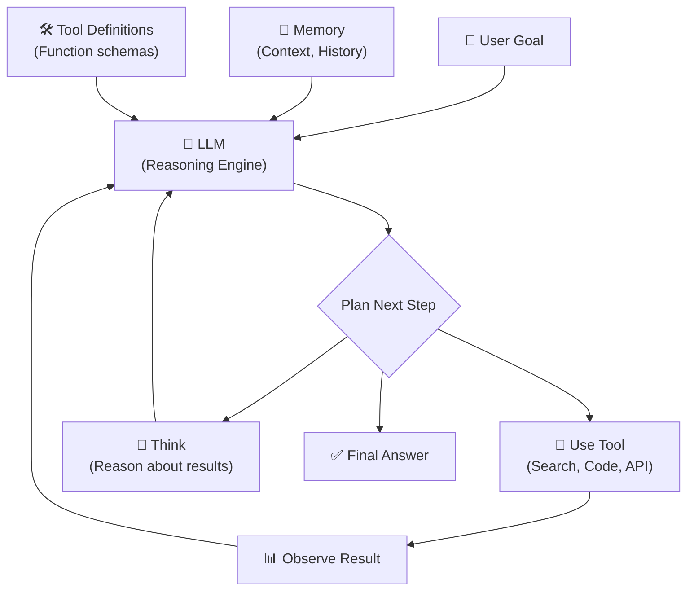

#### The ReAct Pattern (Reason + Act)

```
User: "What's the weather in Tokyo and should I bring an umbrella?"

Agent Thought: I need to check the current weather in Tokyo.
Agent Action: call weather_api(city="Tokyo")
Observation: Temperature: 22°C, Condition: Rain, Humidity: 85%

Agent Thought: It's raining in Tokyo. The user should bring an umbrella.
Agent Action: respond_to_user()
Response: "It's currently 22°C and raining in Tokyo with 85% humidity. 
           Yes, definitely bring an umbrella! ☂️"
```

#### Tool Use / Function Calling
Modern LLMs support **function calling** — the model outputs structured JSON describing which tool to call and with what arguments:

```json
{
  "function": "search_database",
  "arguments": {
    "query": "Tokyo weather forecast",
    "source": "weather_api"
  }
}
```

The orchestrator executes the function and returns the result to the LLM for the next reasoning step.

### 🔑 Key Takeaway
> Agents transform LLMs from **passive text generators** into **active problem solvers** that can plan, use tools, and iterate. They are the foundation of modern AI applications.

---

## 19. Multi-Agent Systems

### 🎯 Learning Objective
Understand how multiple AI agents collaborate to solve complex tasks.

### 💡 Concept

**Multi-Agent Systems** use multiple specialized agents that collaborate, delegate, and coordinate to accomplish goals that a single agent cannot.

#### Why Multi-Agent?
- **Specialization:** Each agent has domain expertise and specific tools
- **Parallelism:** Agents can work on sub-tasks simultaneously
- **Reliability:** Agents can review each other's work (critic/reviewer patterns)
- **Scalability:** Add new capabilities by adding new agents

#### Common Multi-Agent Patterns

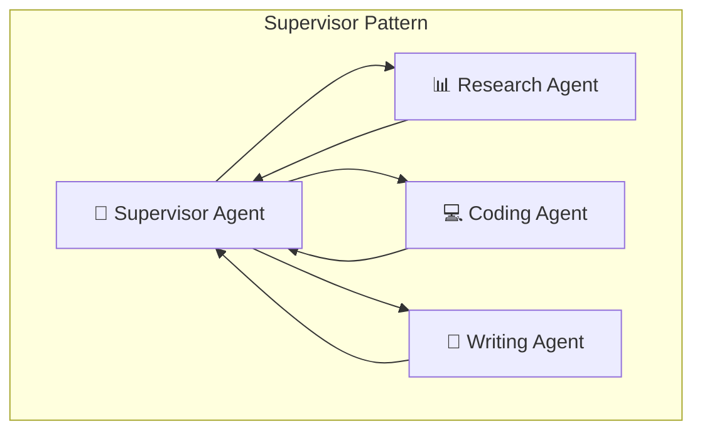

| Pattern | How It Works | Use Case |
|---------|-------------|----------|
| **Supervisor** | One agent orchestrates, delegates to worker agents | Complex workflows |
| **Debate/Discussion** | Agents argue different perspectives, reach consensus | Research, analysis |
| **Pipeline** | Output of one agent feeds into the next | Content creation |
| **Critic/Reviewer** | One agent generates, another reviews and requests revisions | Code generation |
| **Swarm** | Dynamic handoff between agents based on topic | Customer support |

#### Example: Software Development Multi-Agent System

```
User: "Build a REST API for a todo app"

1. 🏗️ Architect Agent
   → Designs API schema, chooses tech stack, creates project structure

2. 💻 Developer Agent  
   → Implements the API endpoints based on architect's design

3. 🧪 Tester Agent
   → Writes and runs unit tests, reports failures

4. 🔍 Code Review Agent
   → Reviews code for best practices, security issues

5. 📝 Documentation Agent
   → Generates API documentation and README
```

#### Frameworks

| Framework | Maintainer | Key Feature |
|-----------|-----------|-------------|
| **LangGraph** | LangChain | Graph-based state machines for agent workflows |
| **CrewAI** | CrewAI | Role-based agent collaboration |
| **AutoGen** | Microsoft | Conversational multi-agent framework |
| **Swarm** | OpenAI | Lightweight agent handoff framework |
| **Google ADK** | Google | Agent Development Kit with Gemini integration |

### 🔑 Key Takeaway
> Multi-agent systems bring **division of labor** to AI. Each agent does what it does best, and their collaboration produces results beyond any single agent's capability.

---

## 20. Orchestration & MCP

### 🎯 Learning Objective
Understand agent orchestration patterns and the Model Context Protocol (MCP) standard.

### 💡 Concept

#### Orchestration
**Orchestration** is the coordination layer that manages:
- **Agent lifecycle:** Starting, stopping, and monitoring agents
- **Task routing:** Deciding which agent handles which sub-task
- **State management:** Maintaining shared context across agents
- **Error handling:** Retries, fallbacks, and graceful degradation
- **Tool management:** Registering and providing tools to agents

#### Orchestration Patterns

| Pattern | Description | Tradeoff |
|---------|-------------|----------|
| **Sequential** | Tasks execute in order, each depending on the previous | Simple, slow |
| **Parallel** | Independent tasks run simultaneously | Fast, complex coordination |
| **Conditional** | Route based on intermediate results | Flexible, harder to debug |
| **Loop** | Iterative refinement until quality threshold met | High quality, unpredictable runtime |
| **DAG** | Directed Acyclic Graph — dependency-based execution | Maximum parallelism with correctness |

#### Model Context Protocol (MCP)

**MCP** is an open standard (introduced by Anthropic, adopted broadly) that standardizes how AI models connect to external tools and data sources.

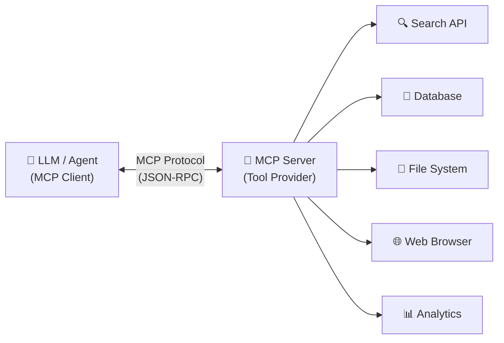

#### Why MCP?

**Before MCP:** Every AI tool integration was a custom, one-off implementation.
```
App 1 ←→ Custom Integration ←→ Slack API
App 1 ←→ Custom Integration ←→ GitHub API
App 2 ←→ Different Custom Integration ←→ Slack API  (duplicate effort!)
```

**With MCP:** One standard protocol, universal compatibility.
```
Any MCP Client ←→ MCP Protocol ←→ Any MCP Server
```

#### MCP Architecture

| Component | Role |
|-----------|------|
| **MCP Host** | The AI application (IDE, chatbot, agent) |
| **MCP Client** | Protocol handler inside the host |
| **MCP Server** | Exposes tools, resources, and prompts via the standard |
| **Transport** | Communication layer (stdio, SSE, HTTP) |

#### MCP Capabilities

| Capability | What It Provides |
|------------|-----------------|
| **Tools** | Functions the model can call (e.g., `search_web`, `create_file`) |
| **Resources** | Data the model can read (e.g., file contents, database rows) |
| **Prompts** | Reusable prompt templates for common tasks |
| **Sampling** | Server can request LLM completions (bidirectional!) |

### 🔑 Key Takeaway
> Orchestration manages the complexity of multi-agent systems. **MCP is emerging as the universal standard** for connecting AI to external tools — think of it as **"USB for AI."** Build MCP-compatible tools and they'll work with any AI application.

---

## 21. Knowledge Ingestion

### 🎯 Learning Objective
Understand how to prepare and ingest diverse knowledge sources into an AI-ready format.

### 💡 Concept

**Knowledge Ingestion** is the process of extracting, transforming, and loading (ETL) knowledge from various sources into formats that AI systems can consume.

#### The Ingestion Pipeline


#### Source Types & Extraction Challenges

| Source | Challenge | Solution |
|--------|-----------|----------|
| **PDFs** | Layouts, tables, images, scanned text | Unstructured.io, Adobe Extract, PyMuPDF |
| **Web Pages** | JavaScript rendering, dynamic content | Playwright, Puppeteer, Firecrawl |
| **Databases** | Schema mapping, relationships | Text2SQL, structured export |
| **APIs** | Rate limits, pagination, auth | Custom connectors |
| **Code Repositories** | AST parsing, dependency graphs | Tree-sitter, language servers |
| **Images/Videos** | OCR, scene understanding | Vision models, Whisper (audio) |
| **Spreadsheets** | Tables, formulas, multiple sheets | Pandas, tabular-to-text conversion |

#### Data Cleaning Best Practices
1. **Remove boilerplate:** Headers, footers, navigation, ads
2. **Normalize formatting:** Consistent headings, bullet points, whitespace
3. **Preserve structure:** Maintain table structure, lists, code blocks
4. **Metadata extraction:** Capture title, author, date, source URL
5. **Deduplication:** Remove duplicate or near-duplicate content
6. **Quality filtering:** Remove low-quality, irrelevant, or corrupted content

#### Metadata Strategy
Always store rich metadata alongside your vectors:

```json
{
  "content": "The attention mechanism allows...",
  "metadata": {
    "source": "transformer_paper.pdf",
    "page": 5,
    "section": "3.2 Scaled Dot-Product Attention",
    "author": "Vaswani et al.",
    "date": "2017-06-12",
    "doc_type": "research_paper",
    "chunk_index": 12,
    "total_chunks": 47
  }
}
```

### 🔑 Key Takeaway
> The quality of your AI system is **directly proportional to the quality of your ingested knowledge.** Invest heavily in extraction, cleaning, and metadata — garbage in = garbage out.

---

## 22. Retrieval Optimization

### 🎯 Learning Objective
Learn advanced techniques to improve the relevance and quality of retrieved information in RAG pipelines.

### 💡 Concept

Retrieval optimization goes beyond basic vector search to maximize the relevance of information provided to the LLM.

#### Optimization Techniques

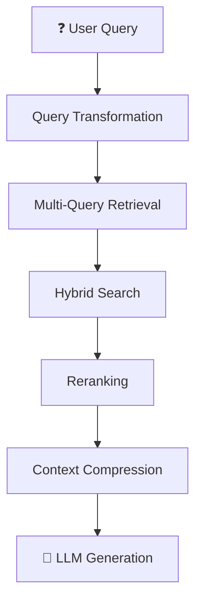

#### 1. Query Transformation

| Technique | Description |
|-----------|-------------|
| **Query Rewriting** | LLM rewrites the user query for better retrieval |
| **HyDE (Hypothetical Document Embedding)** | Generate a hypothetical answer, embed that for search |
| **Step-Back Prompting** | Ask a more general question first, then specific |
| **Query Decomposition** | Break complex queries into simpler sub-queries |

**HyDE Example:**
```
User Query: "How does photosynthesis work?"

HyDE Step 1: LLM generates hypothetical answer:
  "Photosynthesis is the process by which plants convert 
   sunlight, water, and CO2 into glucose and oxygen..."

HyDE Step 2: Embed this hypothetical answer
HyDE Step 3: Search for real documents similar to this answer
             (document-to-document similarity > query-to-document)
```

#### 2. Multi-Query Retrieval
Generate multiple variations of the query and retrieve for each:
```
Original: "What causes climate change?"
Variation 1: "What are the main drivers of global warming?"
Variation 2: "Human activities contributing to climate change"
Variation 3: "Greenhouse gas emissions and their effects on climate"
→ Retrieve for all 3, merge and deduplicate results
```

#### 3. Parent-Child Retrieval
- **Index:** Small chunks (child) for precise matching
- **Return:** Larger chunks (parent) for richer context
- **Result:** Precision of small chunks + context of large chunks

#### 4. Context Compression
After retrieval, compress chunks to keep only the relevant portions:
```
Retrieved Chunk (500 tokens): "... The company was founded in 1998. 
  [irrelevant history] ... In 2023, they reported revenue of $5.2B 
  [more irrelevant details] ... Their AI division grew 300% ..."

Compressed (100 tokens): "The company reported $5.2B revenue in 2023. 
  Their AI division grew 300%."
```

#### 5. Evaluation-Driven Iteration

| Metric | Target | If Below Target |
|--------|--------|----------------|
| **Retrieval Recall@10** | > 0.85 | Improve chunking, add multi-query |
| **Retrieval Precision@5** | > 0.70 | Add reranking, improve embeddings |
| **Answer Faithfulness** | > 0.90 | Improve prompt, add compression |
| **Answer Relevancy** | > 0.85 | Improve query transformation |

### 🔑 Key Takeaway
> Retrieval optimization is an **iterative process.** Start simple (basic vector search), measure performance, and progressively add techniques (hybrid search → reranking → query transformation → compression) until you hit your quality targets.

---

## 23. 🔬 Hands-On: Teachable Machine Demo

### 🎯 Learning Objective
Train a custom image classification model using Google's Teachable Machine, export it as a TensorFlow/Keras model, and run inference in Python code.

> [!IMPORTANT]
> This demo uses a small training set for speed. In production, use **hundreds to thousands** of images per class for robust generalization.

---

### Step 1: Open Teachable Machine

Navigate to **[Teachable Machine](https://teachablemachine.withgoogle.com/)**

1. Click **"Get Started"**
2. Select **"Image Project"**
3. Choose **"Standard Image Model"**

---

### Step 2: Collect Training Data

You'll create **two classes** for this demo: **Laptop** and **Mobile**.

#### For each class:
1. **Rename** the class from "Class 1" to `Laptop` (and "Class 2" to `Mobile`)
2. Click **"Webcam"** to capture samples, or **"Upload"** to use existing images
3. Capture/upload **30–50 images per class** minimum
4. **Vary the conditions:** Different angles, lighting, backgrounds, distances

> [!TIP]
> More diversity in your training images = better generalization. Move the object around, change the background, adjust lighting. This combats **overfitting** (Section 4).

---

### Step 3: Train the Model

1. Click **"Train Model"**
2. Wait for training to complete (~30 seconds to 2 minutes)
3. **Test it:** Use the preview panel to point your webcam at a laptop or mobile device
4. Observe the **confidence scores** — the model shows prediction probability for each class

#### Under the Hood
- Architecture: **MobileNet V2** (lightweight CNN designed for mobile/edge devices)
- Training: **Transfer learning** — the base model is pre-trained on ImageNet; only the final classification layers are retrained on your data
- Input: 224×224 pixel RGB images, normalized to [-1, 1]

---

### Step 4: Export the Model

1. Click **"Export Model"**
2. Select the **"Tensorflow"** tab
3. Choose **"Keras"** format
4. Click **"Download my model"**
5. Extract the downloaded `.zip` file. You'll get:
   - `keras_model.h5` — The trained model weights and architecture
   - `labels.txt` — Class labels (one per line)

---

### Step 5: Set Up the Python Environment

```bash
# Create a project directory
mkdir teachable_machine_demo && cd teachable_machine_demo

# Copy the exported files here
# Place keras_model.h5, labels.txt, and a test.jpg image in this directory

# Install dependencies using uv (fast Python package manager)
uv venv .venv
# Activate the virtual environment
# Windows:
.venv\Scripts\activate
# Linux/Mac:
# source .venv/bin/activate

# Install required packages
uv pip install tensorflow pillow numpy
```

> [!NOTE]
> If using **Keras 3** (bundled with TensorFlow ≥ 2.16), the Teachable Machine H5 export may need patching for compatibility. See the Troubleshooting section below.

---

### Step 6: The Inference Code

Create a file called `model_test.py`:

```python
from keras.models import load_model  # TensorFlow is required for Keras to work
from PIL import Image, ImageOps  # Install pillow instead of PIL
import numpy as np

# Disable scientific notation for clarity
np.set_printoptions(suppress=True)

# Load the model
model = load_model("keras_model.h5", compile=False)

# Load the labels
class_names = open("labels.txt", "r").readlines()

# Create the array of the right shape to feed into the keras model
# The 'length' or number of images you can put into the array is
# determined by the first position in the shape tuple, in this case 1
data = np.ndarray(shape=(1, 224, 224, 3), dtype=np.float32)

# Replace this with the path to your image
image = Image.open("test.jpg").convert("RGB")

# resizing the image to be at least 224x224 and then cropping from the center
size = (224, 224)
image = ImageOps.fit(image, size, Image.Resampling.LANCZOS)

# turn the image into a numpy array
image_array = np.asarray(image)

# Normalize the image
normalized_image_array = (image_array.astype(np.float32) / 127.5) - 1

# Load the image into the array
data[0] = normalized_image_array

# Predicts the model
prediction = model.predict(data)
index = np.argmax(prediction)
class_name = class_names[index]
confidence_score = prediction[0][index]

# Print prediction and confidence score
print("Class:", class_name[2:], end="")
print("Confidence Score:", confidence_score)
```

---

### Step 7: Understanding the Code

Let's break down what each section does:

#### 1. Model Loading
```python
model = load_model("keras_model.h5", compile=False)
```
- Loads the pre-trained MobileNet V2 model from the H5 file
- `compile=False` skips optimizer reconstruction (not needed for inference)

#### 2. Image Preprocessing
```python
image = Image.open("test.jpg").convert("RGB")
size = (224, 224)
image = ImageOps.fit(image, size, Image.Resampling.LANCZOS)
```
- Opens the image and ensures it's RGB (3 channels)
- Resizes to **224×224** — the exact input size MobileNet expects
- `ImageOps.fit` resizes and center-crops to maintain aspect ratio

#### 3. Normalization
```python
normalized_image_array = (image_array.astype(np.float32) / 127.5) - 1
```
- Converts pixel values from [0, 255] to **[-1, 1]**
- This matches the normalization used during training
- Formula: `pixel_normalized = (pixel / 127.5) - 1`

#### 4. Prediction
```python
prediction = model.predict(data)  # e.g., [[0.92, 0.08]]
index = np.argmax(prediction)      # → 0 (index of highest probability)
class_name = class_names[index]     # → "0 Laptop"
confidence_score = prediction[0][index]  # → 0.92
```
- `model.predict()` returns probability scores for each class
- `np.argmax()` finds the class with the highest probability
- The confidence score tells you how certain the model is

---

### Step 8: Run the Inference

```bash
python model_test.py
```

**Expected Output:**
```
Class: Laptop
Confidence Score: 0.9234567
```

---

### Step 9: Experiment!

Try these experiments to reinforce the concepts from this Codelab:

| Experiment | Concept Demonstrated |
|-----------|---------------------|
| Test with an image not in training set | Generalization (Section 4) |
| Test with a blurry/dark image | Robustness & Data Quality |
| Add a 3rd class and retrain | Multi-class classification |
| Train with only 5 images per class | Overfitting (Section 4) |
| Test with an image of neither class | Confidence calibration, Hallucination analog |
| Check which image regions matter | Explainability — Grad-CAM (Section 15) |

---

### Troubleshooting: Keras 3 Compatibility

> [!WARNING]
> If you see errors like `TypeError: DepthwiseConv2D got unexpected keyword argument 'groups'` or `ValueError: Layer expected 1 input(s), got 2 tensors`, the H5 file needs patching for Keras 3.

**The Problem:** Teachable Machine exports models with legacy Keras 2 metadata. Keras 3 (TF ≥ 2.16) enforces stricter deserialization.

**The Fix:** Patch the H5 model metadata using `h5py`:

```python
import h5py
import json

with h5py.File("keras_model.h5", "r+") as f:
    config = json.loads(f.attrs["model_config"])
    
    # Fix 1: Remove 'groups' from DepthwiseConv2D layers
    config_str = json.dumps(config)
    # (Apply regex or string replacement to remove 'groups' key
    #  from DepthwiseConv2D config blocks)
    
    # Fix 2: Flatten nested output_layers
    # Navigate to the sequential model's output_layers and
    # ensure they're not doubly-nested: [[["layer", 0, 0]]]
    # should be [["layer", 0, 0]]
    
    f.attrs["model_config"] = json.dumps(config)
```

> After patching, `load_model("keras_model.h5", compile=False)` will work correctly.

---

### Step 10: What You've Built

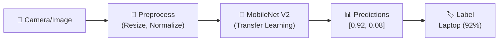

You've built a complete **ML inference pipeline:**
1. **Data Collection** → Teachable Machine webcam/upload
2. **Training** → Transfer learning on MobileNet V2
3. **Export** → TensorFlow/Keras H5 format
4. **Inference** → Python script with image preprocessing and prediction

This same pattern scales to production — swap in more data, a larger model, and deploy to a server or edge device.

---

## 🎓 Session Recap

### Foundation Layer
| Topic | Core Insight |
|-------|-------------|
| How AI Learns | Iterative numerical optimization, not thinking |
| Why AI Feels Intelligent | Scale + data + attention = emergence |
| Hallucinations | Plausibility ≠ truth; inherent to generative models |
| Overfitting vs Underfitting | Generalization is the goal; validate on unseen data |
| AI Bias | Systemic issue at every pipeline stage |

### Core NLP Layer
| Topic | Core Insight |
|-------|-------------|
| Tokenization | Sub-word units; budget-aware prompt design |
| Embeddings | Meaning as geometry in vector space |
| Attention | Dynamic, contextual token relationships |

### RAG & Search Layer
| Topic | Core Insight |
|-------|-------------|
| Chunking | Document splitting strategy directly impacts quality |
| Vector Databases | Memory layer for semantic search |
| Search Paradigms | Hybrid search is the production gold standard |
| Reranking | Highest-leverage RAG improvement |
| RAG | Ground LLMs in real data for factual responses |

### Trust & Applied AI Layer
| Topic | Core Insight |
|-------|-------------|
| Explainable AI | Transparency is essential for high-stakes AI |
| Evaluation Metrics | Multiple metrics + human judgment |
| Prompt Engineering | Be specific, structured, and iterative |

### Agentic AI Layer
| Topic | Core Insight |
|-------|-------------|
| AI Agents | LLMs + Planning + Tools + Memory |
| Multi-Agent Systems | Specialization and collaboration |
| Orchestration & MCP | Universal standard for AI-tool connectivity |

### Advanced RAG Layer
| Topic | Core Insight |
|-------|-------------|
| Knowledge Ingestion | Quality in = quality out |
| Retrieval Optimization | Iterative improvement with measurable metrics |

### Practical Layer
| Topic | Core Insight |
|-------|-------------|
| Teachable Machine Demo | End-to-end ML pipeline: collect → train → export → infer |

---

> **Thank you for attending AI Unboxed! 🚀**
> 
> *From ChatGPT to Intelligent Machines — you now have the conceptual toolkit to understand, evaluate, and build with AI across the full stack.*
