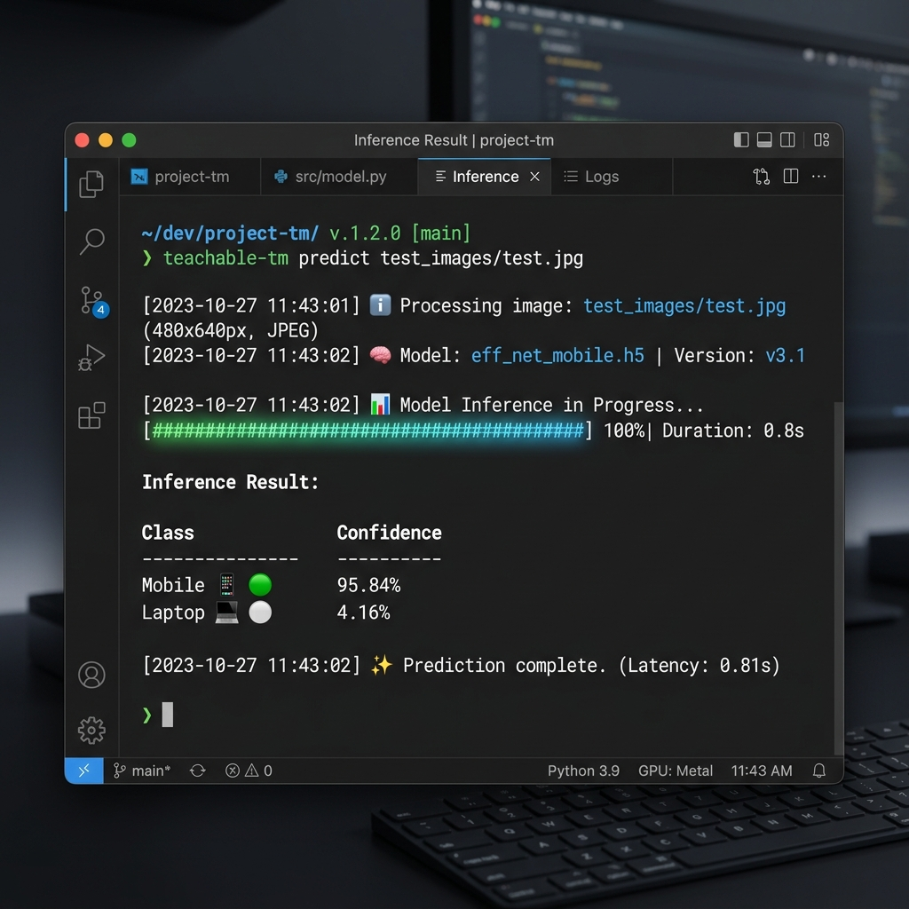

# 🧠 Teachable Machine Classifier Tools


[](tests/)
[](pyproject.toml)
[](src/teachable_machine/)
[](src/teachable_machine/cli.py)

Welcome to the professional-grade, modular toolkit for deploying, patching, and evaluating **Google Teachable Machine** image classification models. 

This repository provides an enterprise-ready Python package (`teachable_machine`) alongside a unified command-line tool (`teachable-tm`) to bridge the gap between initial Teachable Machine web prototypes and production-ready applications.



---

## 📖 Complete Codelab Guide

For the full theoretical breakdown of all 22+ topics covered in this curriculum (including Attention, Embeddings, RAG, Hybrid Search, Explainable AI, Agentic Architectures, MCP, and more), please refer to:

👉 **[Read the Full AI Unboxed Codelab (CODELAB_AI_Unboxed.md)](CODELAB_AI_Unboxed.md)**

---

## 📁 Clean Architecture Layout

The project has been overhauled to follow standard Python packaging conventions:

```files
├── src/
│   └── teachable_machine/
│       ├── __init__.py           # Package exports & metadata
│       ├── classifier.py         # ImageClassifier core inference engine
│       ├── patcher.py            # H5 metadata patcher for Keras 3 compatibility
│       ├── evaluator.py          # Dataset evaluator (accuracy, confusion matrix, precision/recall)
│       ├── cli.py                # Console CLI commands
│       ├── exceptions.py         # Structured exception hierarchy
│       └── utils.py              # Label parsers and path helpers
├── tests/
│   ├── test_classifier.py        # Classifier integration tests
│   └── test_patcher.py           # Model metadata patching unit tests
├── model/
│   ├── keras_model.h5            # Pre-trained Keras model
│   ├── labels.txt                # Class label mapping file (0: Laptop, 1: Mobile)
│   └── archive/
│       └── converted_keras.zip   # Original model export archive
├── test_images/
│   ├── test.jpg                  # Sample test image 1
│   ├── test-2.jpg                # Sample test image 2
│   └── test-3.webp               # Sample test image 3
├── dataset/
│   ├── Laptop/                   # Subfolder of Laptop photos for evaluation
│   └── Mobile/                   # Subfolder of Mobile photos for evaluation
├── assets/
│   └── cli_screenshot.png        # Command-line interface usage preview screenshot
├── pyproject.toml                # Package configuration & dependency manifest
├── model_test.py                 # Thin, backward-compatible wrapper script
├── README.md                     # Redesigned professional documentation
└── .gitignore                    # Python & IDE exclusion rules
```

---

## ⚡ Quick Start: Running Inference

### 1. Prerequisites
Ensure you have Python 3.10+ installed. We recommend using `uv` (a fast Python package installer and resolver), but standard `pip` works.

### 2. Set Up Environment & Install

#### Using `uv` (Recommended):
```bash
# Create a virtual environment
uv venv .venv

# Activate the virtual environment
# Windows (PowerShell):
.venv\Scripts\Activate.ps1
# Windows (CMD):
.venv\Scripts\activate.bat
# Linux/macOS:
source .venv/bin/activate

# Install the package and dependencies in editable mode
uv pip install -e .
```

#### Using Standard `pip`:
```bash
# Create virtual environment
python -m venv .venv

# Activate environment
.venv\Scripts\Activate.ps1

# Install package in editable mode
pip install -e .
```

### 3. Run Predictions

You can verify the setup by running the root legacy script directly:
```bash
python model_test.py
```

Or execute via the newly registered command-line application `teachable-tm`:
```bash
teachable-tm predict test_images/test.jpg
```

---

## 🛠️ CLI Reference: `teachable-tm`

The package registers a unified command-line tool `teachable-tm` with rich console outputs and status animations.

### 1. Image Prediction
Classify an image using a model and label file.
```bash
teachable-tm predict <image_path> [--model model/keras_model.h5] [--labels model/labels.txt]
```

### 2. Keras 3 Compatibility Patching
Teachable Machine exports legacy model structures (built for Keras 2) which throw exceptions like `TypeError: DepthwiseConv2D got unexpected keyword argument 'groups'` in newer Keras/TensorFlow versions.

Apply metadata patching to safely fix the model files:
```bash
teachable-tm patch <model_path>
```
*Note: A backup of the model (`.h5.bak`) is created automatically unless `--no-backup` is specified.*

### 3. Dataset Evaluation
Evaluate model metrics across a structured dataset folder. The dataset folder must contain subdirectories representing the target classes, filled with test images.
```bash
teachable-tm evaluate <dataset_path> [--output report.md]
```

---

## 🐍 Library API Usage

You can easily integrate this package into any Python codebase:

```python
from teachable_machine import ImageClassifier, TeachableException

try:
    # Initialize the classifier engine (loads model once)
    classifier = ImageClassifier(model_path="model/keras_model.h5", label_path="model/labels.txt")
    
    # Run prediction on a file path or PIL.Image
    result = classifier.predict("test_images/test.jpg")
    
    # Access structured fields
    print(f"Class: {result.class_name}")
    print(f"Confidence: {result.confidence:.4f}")
    
    # Get all class probabilities
    for label, probability in result.probabilities.items():
        print(f" - {label}: {probability * 100:.2f}%")
        
except TeachableException as e:
    print(f"Teachable Machine Inference Error: {e}")
```

---

## 🔬 Dataset Evaluation Pipeline

The evaluator generates performance tables (Precision, Recall, F1-Score, Support) and a Confusion Matrix to analyze classification strengths:

```
Dataset Evaluation Summary
Accuracy: 95.45%
Processed: 22 images

Class Performance
-------------------------------------------------------------
Class      Precision      Recall    F1-Score      Support
-------------------------------------------------------------
Laptop        1.0000      0.9091      0.9524           11
Mobile        0.9167      1.0000      0.9565           11
-------------------------------------------------------------

Confusion Matrix (Row: Actual, Column: Predicted)
-------------------------------------------------------------
Actual \ Predicted       Laptop       Mobile
-------------------------------------------------------------
Laptop                       10            1
Mobile                        0           11
-------------------------------------------------------------
```

---

## 🧪 Running Unit & Integration Tests

Ensure code correctness and package structure by executing tests via `pytest`:

```bash
# Install test requirements
uv pip install -e .[dev]

# Run tests
pytest
```
