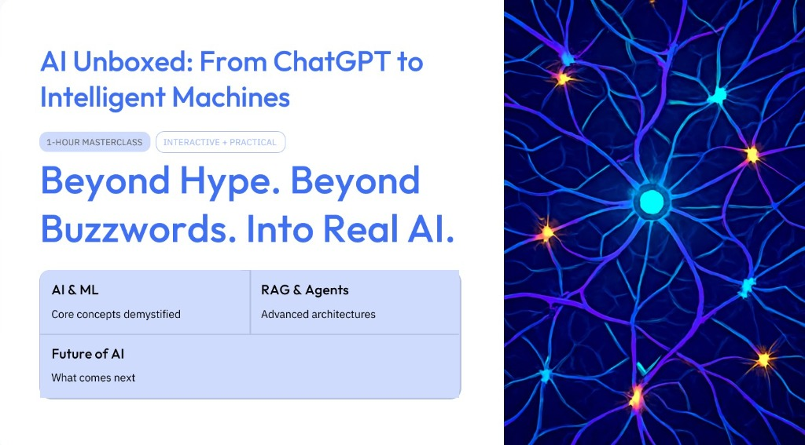

# 🧠 AI Unboxed: From ChatGPT to Intelligent Machines



> **Hands-on Generative AI workshops — from neural network foundations to autonomous agents and computer vision.**
> Tokenization, attention, embeddings, hybrid search, RAG pipelines, model testing, Keras patching, Explainable AI, and agent architectures.
> Fully self-paced. Runs anywhere: cloud, local, or fully offline.
> 
> 🎥 **[Watch the full 3-hour video session on YouTube!](https://www.youtube.com/watch?v=-8xTRNfq-DE)**

[](https://colab.research.google.com/github/imaakanksha/AI-Unboxed-Teachable-Machine-Codelab/blob/main/01_ai_foundations/Workshop_1_AI_Foundations.ipynb)
[](https://colab.research.google.com/github/imaakanksha/AI-Unboxed-Teachable-Machine-Codelab/blob/main/02_core_nlp_and_rag/Workshop_2_Core_NLP_and_RAG.ipynb)
[](./03_teachable_machine_and_agentic_ai)
[](https://www.youtube.com/watch?v=-8xTRNfq-DE)
[](./LICENSE)

---

## 🎯 What You'll Learn

By completing this workshop series, you will be able to:

- ✅ Explain **how neural networks learn** via forward passes, loss functions, backpropagation, and gradient descent.
- ✅ Analyze the mechanics behind **emergent capabilities** and structural model hallucinations.
- ✅ Diagnose model training failures like **overfitting vs. underfitting**.
- ✅ **Tokenize text** using BPE/WordPiece and compute **semantic embeddings similarity**.
- ✅ Deconstruct the Transformer's **self-attention equation** ($Q, K, V$ vectors).
- ✅ Construct and configure **RAG chunking strategies** (overlap, fixed, paragraph, recursive).
- ✅ Build **vector similarity, lexical, and hybrid search indexes** with reranking.
- ✅ Patch legacy **Keras model metadata** to resolve Keras 3 version compatibility errors.
- ✅ Evaluate image classification engines using **precision, recall, and confusion matrices**.
- ✅ Describe the role of classifiers as **perception tools** in autonomous agent loops.

---

## 🗺️ Workshop Series

| # | Workshop | What You'll Build / Learn | Format | Time | Link |
|:-:|---------|---------------------------|--------|:----:|:----:|
| 1 | **[Foundations of AI](./01_ai_foundations/)** | Optimization loop simulation, logit temperature scaling, polynomial overfitting curve | Colab Notebook | ~90 min | [👉 Open](./01_ai_foundations/) |
| 2 | **[Core NLP & RAG](./02_core_nlp_and_rag/)** | Sub-word tokenizer mapping, cosine similarity calculations, attention weights outputs, in-memory RAG | Colab Notebook | ~2 hrs | [👉 Open](./02_core_nlp_and_rag/) |
| 3 | **[Teachable Machine & Agentic AI](./03_teachable_machine_and_agentic_ai/)** | Modular classification app, Keras compatibility patch CLI, dataset evaluator, advanced agent loop guides | Python Package | ~2 hrs | [👉 Open](./03_teachable_machine_and_agentic_ai/) |

---

## 🚀 Quick Start

Each workshop is **self-contained**. Clone the repository and choose your entry point:

```bash
git clone https://github.com/imaakanksha/AI-Unboxed-Teachable-Machine-Codelab.git
cd AI-Unboxed-Teachable-Machine-Codelab

# Workshop 1 or 2: Launch Jupyter locally or click the Colab badges
cd 01_ai_foundations
# Open Workshop_1_AI_Foundations.ipynb

# Workshop 3: Install and run the command-line tool
cd ../03_teachable_machine_and_agentic_ai
pip install -e .
teachable-tm predict test_images/test.jpg
```

---

## 🏗️ Learning Path

```
┌────────────────────────┐    ┌────────────────────────┐    ┌──────────────────────────┐
│  01  AI FOUNDATIONS     │    │  02  CORE NLP & RAG     │    │  03  TEACHABLE MACHINE   │
│                        │    │                        │    │                          │
│  • Optimization loop   │    │  • Sub-word tokenizers │    │  • Image classifier CLI  │
│  • Token probabilities │───▶│  • Attention mechanics  │───▶│  • Keras 3 metadata patch │
│  • Temperature scaling │    │  • Vector embeddings   │    │  • Dataset evaluation    │
│  • Overfitting curves  │    │  • In-memory RAG index │    │  • Agent perception guide│
└────────────────────────┘    └────────────────────────┘    └──────────────────────────┘
      Foundations                   NLP Pipelines                 Production-Grade
```

**Recommended order:** 1 → 2 → 3 (each workshop builds on the previous conceptual framework).

---

## 📋 Prerequisites

| Requirement | Workshop 1 | Workshop 2 | Workshop 3 |
|-------------|:----------:|:----------:|:----------:|
| Python 3.10+ | ✅ (via Colab) | ✅ (via Colab) | ✅ (local) |
| Google Account | ✅ | ✅ | Optional |
| GPU | ❌ Not required | ❌ Not required | Optional (runs on CPU) |
| Prior ML knowledge | ❌ None | Workshop 1 | Workshops 1 & 2 |

---

## 👨&zwj;🏫 For Instructors

Each workshop directory contains a `guides/` subdirectory containing:
- `INSTRUCTOR_GUIDE.md`: Target timetables, teaching hooks, student roadblocks, and quiz answers.
- `RESOURCES.md` / `STUDENT_RESOURCES.md`: Deep dive links to research papers, documentation, and tools.
- `PRESENTATION_SCRIPT.md` (W3): Word-for-word presentation delivery guidelines and terminal demonstration cues.

---

## 🏗️ Repository Structure

```
AI-Unboxed-Teachable-Machine-Codelab/
├── README.md                    ← You are here
├── LICENSE                      (MIT)
├── CONTRIBUTING.md
├── CHANGELOG.md
├── banner.jpg                   (Banner Image)
│
├── 01_ai_foundations/
│   ├── README.md                Student guide
│   ├── Workshop_1_AI_Foundations.ipynb
│   └── guides/
│       ├── INSTRUCTOR_GUIDE.md
│       └── RESOURCES.md
│
├── 02_core_nlp_and_rag/
│   ├── README.md                Student guide
│   ├── Workshop_2_Core_NLP_and_RAG.ipynb
│   └── guides/
│       ├── INSTRUCTOR_GUIDE.md
│       └── RESOURCES.md
│
└── 03_teachable_machine_and_agentic_ai/
    ├── README.md                Student guide
    ├── pyproject.toml           Package file
    ├── model_test.py            Legacy test script
    ├── report.md                Evaluation output
    ├── src/                     Core source code
    ├── tests/                   Unit tests
    ├── model/                   Model binaries
    ├── test_images/             Test sample files
    ├── dataset/                 Evaluation images
    └── guides/
        ├── INSTRUCTOR_GUIDE.md
        ├── PRESENTATION_SCRIPT.md
        └── STUDENT_RESOURCES.md
```

---

## 🤝 Contributing

Found an issue or want to contribute a correction? Please read [CONTRIBUTING.md](./CONTRIBUTING.md).

---

## 📄 License

This repository is licensed under the [MIT License](./LICENSE).

---

## 🙏 Acknowledgements

- Structured references inspired by [bhaskarjha-dev/genai-workshops](https://github.com/bhaskarjha-dev/genai-workshops).
- Core classifier code and models exported from [Google Teachable Machine](https://teachablemachine.withgoogle.com/).
